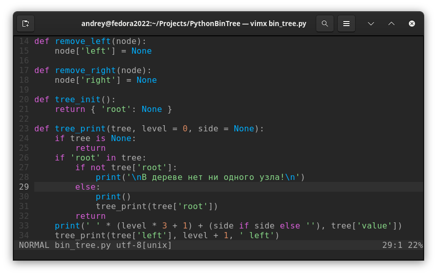

# Лучшие плагины для Vim

## Установка плагинов

Здесь я описываю только то, что мне самому было нужно и то что мне зашло. <br>
Как менеджер плагинов я использую [vim-plug](https://github.com/junegunn/vim-plug).

Менеджер плагинов ставится командой (из ссылки выше)
```bash
curl -fLo ~/.vim/autoload/plug.vim --create-dirs \
    https://raw.githubusercontent.com/junegunn/vim-plug/master/plug.vim
```

Плагины добавляются в .vimrc вот так:

```vim
call plug#begin('~/.vim/plugged')

Plug 'github-user/repository-name' " плагин
let g:some_plugin_some_param = 1   " настройки плагина (необязательно!)

Plug 'other-user/other-repository' " другой плагин
let g:some_plugin_some_param = 1   " о том как настроить пишут в доке плагина

call plug#end()
```

и устанавливаю их командой `:PlugInstall`,<br>
перед этим перезапуская Vim или перезагружая конфиг с помощью команды `:source ~/.vimrc`.

Буду использовать `C` как сокращение для `Ctrl`, т.е например `C-x` значит `Ctrl + X`.

## Установка темы

[ссылка](https://github.com/joshdick/onedark.vim)

```vim
" call plug#begin('~/.vim/plugged')
" ...
Plug 'joshdick/onedark.vim', { 'branch': 'main' }
" ...
" call plug#end()

colorscheme onedark
```



## Общие плагины (независимо от типа файла)

### Автоматическое переключение языка

[ссылка](https://github.com/lyokha/vim-xkbswitch)

Команды в нормальном режиме можно набирать только английским языком.
Набирать `вв` вместо  `dd` или `з` вместо `p` нельзя.
Но это очень неудобно, когда набираешь текст на двух языках сразу.
Плагин автоматически переключает язык на английский,
при переходе в нормальный режим, и в режиме вставки восстанавливает
тот язык, который был до перехода в нормальный режим.

```vim
" call plug#begin('~/.vim/plugged')
" ...
Plug 'lyokha/vim-xkbswitch'
let g:XkbSwitchEnabled = 1
let g:XkbSwitchLib = '/usr/local/lib/libg3kbswitch.so'
" ...
" call plug#end()
```

Плагин требует зависимого от ОС переключателя языка
(XkbSwitch requires OS dependent keyboard layout switcher).
Подробно можно почитать по ссылке, для GNOME 40+ я выполняю такие команды
([отсюда](https://github.com/lyokha/g3kb-switch)).

```bash
sudo dnf install glib2-devel
git clone https://github.com/lyokha/g3kb-switch
cd g3kb-switch
mkdir build && cd build
cmake -DCMAKE_BUILD_TYPE=Release -DG3KBSWITCH_WITH_GNOME_SHELL_EXTENSION=ON ..
make
sudo make install
cd ../extension
make install  # no sudo requred!
sudo dnf install gnome-extensions-app
# после этого включить G3kbSwitch в GNOME Extensions 
# (расширение может быть не видно, тогда возможно придется перезагрузиться)
```

### Авто-вставка парных симвлов

[ссылка](https://github.com/jiangmiao/auto-pairs)

Плагин, который автоматически добавляет закрывающую скобку, кавычку и.т.д.

```vim
Plug 'jiangmiao/auto-pairs'
```

### Обернуть в скобки

[ссылка](https://github.com/tpope/vim-surround)

Плагин позволяет поставить парные символы вокруг текста или изменить их.

Командой `S(` в режиме выделения(visual) можно добавить
скобки (или другие парные символы, например кавычки) вокруг выделенного текста.
Это работает даже с HTML-тегами, например `S<div>` добавит открывающий и закрывающий тег вокруг текста.
Командой `cs"'` можно изменить тип кавычек (работает с любыми парными символами).
На момент написания заметки, у плагина слегка странное поведение,
если использовать команду `S(`, то кроме скобок добавляется
по одному пробелу (внутри скобок, до и после текста), если
использовать команду `S)`, тогда лишние пробелы не добавляются,
а плагин понимает что нужно до текста вставить `(`, а после текста `)`.

Для изменения тега используется команда `cst<tag>`.

```vim
Plug 'tpope/vim-surround'
```

### Комментирование кода

[ссылка](https://github.com/tyru/caw.vim)

Плагин, с помощью которого очень легко
закомментировать / раскомментировать часть кода.
По умолчанию это делается с помощью команды `gcc`.
Поддерживает более 300 типов файлов.

```vim
Plug 'tyru/caw.vim'
```

### EditorConfig

[ссылка](https://github.com/editorconfig/editorconfig-vim)

Лучше прочитать [на официальном сайте](https://editorconfig.org), что это за штука.
Но если коротко, EditorConfig это специальный файл, в котором задаются
параметры, такие как ширина отступа, тип отступа(пробел / таб), символ "конец строки" (Win / Unix) и.т.д.
А IDE / редакторы с помощью плагина, для каждого конкретного проекта выставляют нужные настройки, 
таким образом в одном редакторе можно поддерживать разные настройки(типа отступов) для разных проектов.
И это удобно для работы в команде, с одним EditorConfig
для одного проекта будут одинаковые настройки (отступы и вот это всё) в разных IDE.

```vim
Plug 'editorconfig/editorconfig-vim'
```

### Дерево файлов

[ссылка](https://github.com/preservim/nerdtree)

Плагин позволяет открыть слева дерево файлов, для навигации по проекту.

Стандартный биндинг `C-N` (`N` можно запомнить как `Navigate`) позволяет открыть / закрыть дерево.
Можно добавить игнорируемые директории, с помощью `g:NERDTreeIgnore`.

```vim
Plug 'preservim/nerdtree'
" Open file tree with C-N
nnoremap <C-n> :NERDTreeToggle<CR>
" Ingore some directories
let g:NERDTreeIgnore = ['^node_modules$']
```

### Навигация с помощью Ctrl + P

[ссылка](https://github.com/ctrlpvim/ctrlp.vim)

Плагин добавляет возможность перехода к нужному файлу через `C-P`.
Достаточно набрать часть имени файла и найдутся файлы с похожим именем.

```vim
Plug 'ctrlpvim/ctrlp.vim'
```

### Навигация по файлам с предпросмотром

[ссылка](https://github.com/junegunn/fzf.vim)

Чтобы найти нужный файл, используется команда `:Files`.

```vim
Plug 'junegunn/fzf', { 'do': { -> fzf#install() } }
Plug 'junegunn/fzf.vim'
```

### Мультикурсоры

[ссылка](https://github.com/mg979/vim-visual-multi)

Плагин, с помощью которого можно использовать мультикурсоры,
примерно как в Sublime Text, VS Code и других подобных им редакторам.

[Здесь](https://github.com/mg979/vim-visual-multi/wiki/Mappings)
можно подробно почитать про настройку.
Я же отключаю стандартные комбинации клавиш,
и оставляю только `C-Up` / `C-Down`.
Стандартный `C-N`(который добавляет курсор к следующему слову) у меня перекрывает `C-N` от NERDTree, да и особо не пользуюсь я таким.

```vim
" Multicursors
Plug 'mg979/vim-visual-multi'
" Disable standard mappings
let g:VM_maps = {}
let g:VM_maps["Add Cursor Up"]   = '<C-Up>'
let g:VM_maps["Add Cursor Down"] = '<C-Down>'
```
Чтобы включить мультикурсоры, нажимаю `C-Up` / `С-Down`,
и дальше нажимаю `i` чтобы перейти в режим вставки.


## Плагины для конкретных языков

## Markdown

[ссылка](https://github.com/iamcco/markdown-preview.nvim)

Плагин позволяет просматривать .md файл
в браузере и автоматически меняет страницу при любых изменениях файла 
(сохраненять файл для этого не нужно).
Сервер требует установленного Node.js и yarn, а запускается командой `:MarkdownPreview`.

```vim
Plug 'iamcco/markdown-preview.nvim', { 'do': 'cd app && yarn install' }
let g:mkdp_page_title = '${name}.md'
```

## LaTeX

[ссылка](https://github.com/lervag/vimtex)

Плагин для сборки .tex файлов.
Команда для сборки `:VimtexCompile`.
Можно настроить программу, в которой откроется собранный файл,
я использую Zathura.

```vim
Plug 'lervag/vimtex'
let g:vimtex_view_method = 'zathura'
```

##  JavaScript / TypeScript

[ссылка](https://github.com/yuezk/vim-js)
[ссылка](https://github.com/maxmellon/vim-jsx-pretty)
[ссылка](https://github.com/HerringtonDarkholme/yats.vim)

Плагины, которые я использую для корректной подсветки синтаксиса JavaScript и TypeScript.

```vim
Plug 'yuezk/vim-js'
Plug 'maxmellon/vim-jsx-pretty'
Plug 'HerringtonDarkholme/yats.vim'
```

